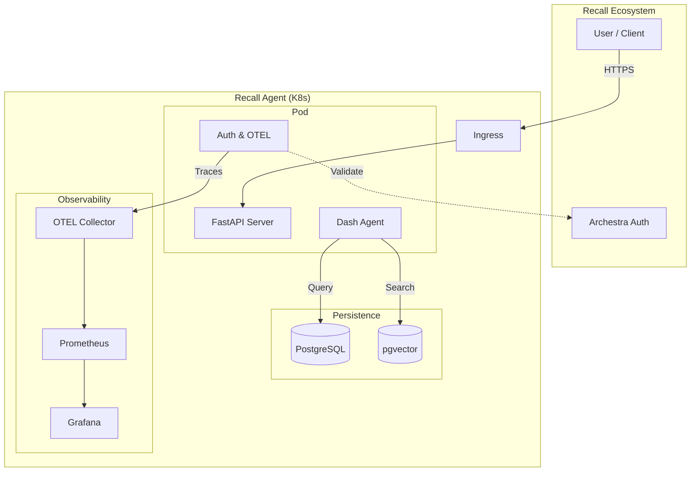

# Recall: The Self-Learning Data Agent


Recall is a production-ready **SQL Agent** that grounds its answers in **6 layers of context** and **improves with every run**.

It solves the "hallucination problem" in Text-to-SQL by treating errors as learning opportunities. When a query fails, Recall diagnosis the issue, fixes it, and **saves the fix** to its permanent memory.

---

## 🏗️ Architecture

Recall sits between your users and your data, ensuring every query is safe, performant, and correct.



---

## 🚀 Key Features

### 🧠 Self-Correction Loop
Recall doesn't just crash on error. It catches SQL exceptions, reads the error message, reflects on the schema, and **retries**. 
Once a fix is found (e.g., "Oh, `revenue` is in cents, not dollars"), it saves a **Learning** to prevent the same mistake forever.

### 🛡️ Trusted Data Policy
Standard LLMs will happily `DROP TABLE users`. Recall implements a strict **Trusted Data Policy**:
- **Read-Only**: `DROP`, `DELETE`, `INSERT` are blocked at the prompt and middleware level.
- **Row Limits**: Queries are capped (default 1000 rows) to prevent DOS.
- **PII Redaction**: (Roadmap) Automatic masking of sensitive columns.

### 👁️ Full Observability
Production means knowing what's happening. Recall includes:
- **OpenTelemetry Tracing**: Trace every step of the agent's reasoning chain (`dash.reasoning` spans).
- **Prometheus Metrics**: 
  - `dash_queries_total`: Request throughput.
  - `dash_query_errors`: Error rates by type.
  - `dash_query_latency_seconds`: p95/p99 latency.
  - `llm_token_usage`: Cost tracking per model.
- **Grafana Dashboard**: Pre-built dashboard included in `grafana/dashboard.json`.

---

## ⚡ Quick Start

### Prerequisites
- Docker & Docker Compose
- OpenAI API Key

### Run with Docker
```bash
# 1. Clone the repo
git clone https://github.com/Keerthivasan-Venkitajalam/Recall.git
cd Recall

# 2. Configure Environment
cp example.env .env
# Edit .env and set OPENAI_API_KEY=sk-***

# 3. Start Services (App, DB, Observability)
docker compose up -d --build

# 4. Load Sample Data
docker exec -it recall-api python -m recall.scripts.load_data
```

Visit **http://localhost:8000/docs** to see the API Swaggers.

---

## 🛠️ Configuration

Recall is configured via Environment Variables.

| Variable | Description | Default |
|----------|-------------|---------|
| `OPENAI_API_KEY` | Required for the LLM. | - |
| `DB_URL` | Postgres connection string. | `postgresql://user:pass@db:5432/recall` |
| `ENABLE_AUTH` | Enable Bearer token validation. | `false` |
| `ARCHESTRA_TOKEN_ENDPOINT` | URL to validate tokens against. | - |
| `ARCHESTRA_OTEL_ENDPOINT` | OTLP gRPC/HTTP endpoint for traces. | - |

---

## 📊 Observability

### Metrics
Recall exposes a standard Prometheus endpoint at `/metrics`.

### Grafana
Import `grafana/dashboard.json` to visualize:
- 📈 **Query Success Rate**
- ⏱️ **Latency Histograms**
- 💰 **Token Usage / Cost**
- 📚 **Learning Rate** (How fast is the agent improving?)

---

## 📚 The "6 Layers of Context"

How does Recall know what you mean? It retrieves context at runtime:

1.  **Table Metadata**: Schema definitions and column types.
2.  **Human Annotations**: Descriptions of what data *actually means*.
3.  **Query Patterns**: "Golden SQL" that is known to work.
4.  **Learnings**: Past mistakes and their fixes.
5.  **Runtime Context**: Current schema state.
6.  **Institutional Knowledge**: Docs/Wikis (via MCP).

---

## 🤝 Contributing

1.  Fork the repo.
2.  Create a feature branch (`git checkout -b feature/amazing-feature`).
3.  Commit your changes (`git commit -m 'Add amazing feature'`).
4.  Push to the branch (`git push origin feature/amazing-feature`).
5.  Open a Pull Request.

---

**Built with ❤️ for the Archestra Architecture Hackathon.**
